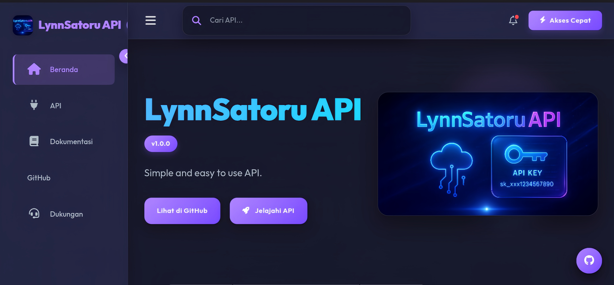

# 🌐 LynnSatoru API UI

Antarmuka modern untuk menjelajahi dan menguji endpoint LynnSatoru API.

📣 Ikuti channel resmi kami di WhatsApp  
👉 https://whatsapp.com/channel/0029VauopJb3AzNYgQXmQj2E

---

## ✨ Fitur Unggulan

- Tema **Terang & Gelap** otomatis sesuai preferensi pengguna  
- Navigasi **responsif** yang optimal untuk semua perangkat  
- **Pencarian real-time** untuk menemukan endpoint dengan cepat  
- **Indikator status API**: menampilkan status siap, error, atau update  
- Fitur **salin instan** ke clipboard untuk URL dan respons API  
- Tampilan respons **JSON dengan highlight** yang indah  
- Form input dinamis dengan label dan deskripsi yang jelas  

---

## 🚀 Penggunaan

1. Salin proyek ke server web kamu  
2. Atur konfigurasi API melalui file konfigurasi  
3. Akses LynnSatoru API UI melalui browser  

Tidak diperlukan instalasi kompleks — cukup unggah dan jalankan.

---

## 🎨 Kustomisasi

- Sesuaikan **warna tema** dan **banner tampilan** sesuai branding kamu  
- Struktur kategori dan endpoint dapat diatur sepenuhnya melalui pengaturan konfigurasi

---

## 🌍 Dukungan Peramban

LynnSatoru API UI berjalan optimal di:

- Google Chrome  
- Mozilla Firefox  
- Microsoft Edge  
- Safari

---

## 🤝 Kontribusi

Kami membuka peluang kontribusi dari siapa saja.  
Kamu bisa mengirim ide, laporan bug, atau peningkatan fitur melalui Pull Request atau diskusi di channel resmi.

---

## 📄 Lisensi

Proyek ini dilisensikan di bawah **MIT License**.  
Lihat file `LICENSE` untuk detail lisensi.

---

Dibuat oleh **LynnSatoru**  
Terima kasih telah menggunakan LynnSatoru API UI!
